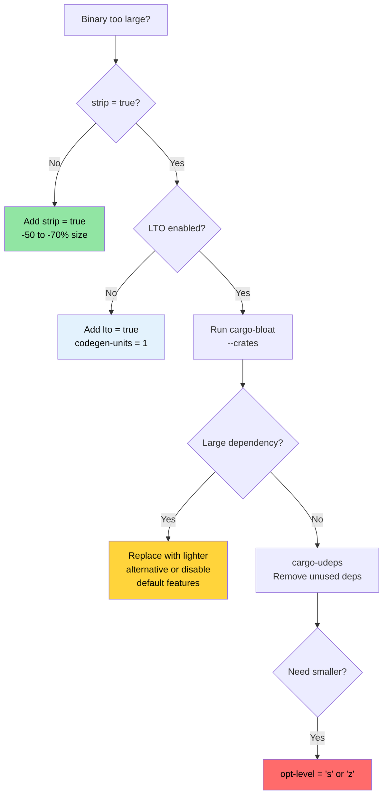

# Release Profiles and Binary Size 🟡

> **What you'll learn:**
> - Release profile anatomy: LTO, codegen-units, panic strategy, strip, opt-level
> - Thin vs Fat vs Cross-Language LTO trade-offs
> - Binary size analysis with `cargo-bloat`
> - Dependency trimming with `cargo-udeps`, `cargo-machete` and `cargo-shear`
>
> **Cross-references:** [Compile-Time Tools](ch08-compile-time-and-developer-tools.md) — the other half of optimization · [Benchmarking](ch03-benchmarking-measuring-what-matters.md) — measure runtime before you optimize · [Dependencies](ch06-dependency-management-and-supply-chain-s.md) — trimming deps reduces both size and compile time

The default `cargo build --release` is already good. But for production
deployment — especially single-binary tools deployed to thousands of servers —
there's a significant gap between "good" and "optimized." This chapter covers
the profile knobs and the tools to measure binary size.

### Release Profile Anatomy

Cargo profiles control how `rustc` compiles your code. The defaults are
conservative — designed for broad compatibility, not maximum performance:

```toml
# Cargo.toml — Cargo's built-in defaults (what you get if you specify nothing)

[profile.release]
opt-level = 3        # Optimization level (0=none, 1=basic, 2=good, 3=aggressive)
lto = false          # Link-time optimization OFF
codegen-units = 16   # Parallel compilation units (faster compile, less optimization)
panic = "unwind"     # Stack unwinding on panic (larger binary, catch_unwind works)
strip = "none"       # Keep all symbols and debug info
overflow-checks = false  # No integer overflow checks in release
debug = false        # No debug info in release
```

**Production-optimized profile** (what the project already uses):

```toml
[profile.release]
lto = true           # Full cross-crate optimization
codegen-units = 1    # Single codegen unit — maximum optimization opportunity
panic = "abort"      # No unwinding overhead — smaller, faster
strip = true         # Remove all symbols — smaller binary
```

**The impact of each setting:**

| Setting | Default → Optimized | Binary Size | Runtime Speed | Compile Time |
|---------|---------------------|-------------|---------------|--------------|
| `lto = false → true` | — | -10 to -20% | +5 to +20% | 2-5× slower |
| `codegen-units = 16 → 1` | — | -5 to -10% | +5 to +10% | 1.5-2× slower |
| `panic = "unwind" → "abort"` | — | -5 to -10% | Negligible | Negligible |
| `strip = "none" → true` | — | -50 to -70% | None | None |
| `opt-level = 3 → "s"` | — | -10 to -30% | -5 to -10% | Similar |
| `opt-level = 3 → "z"` | — | -15 to -40% | -10 to -20% | Similar |

**Additional profile tweaks:**

```toml
[profile.release]
# All of the above, plus:
overflow-checks = true    # Keep overflow checks even in release (safety > speed)
debug = "line-tables-only" # Minimal debug info for backtraces without full DWARF
rpath = false             # Don't embed runtime library paths
incremental = false       # Disable incremental compilation (cleaner builds)

# For size-optimized builds (embedded, WASM):
# opt-level = "z"         # Optimize for size aggressively
# strip = "symbols"       # Strip symbols but keep debug sections
```

**Per-crate profile overrides** — optimize hot crates, leave others alone:

```toml
# Dev builds: optimize dependencies but not your code (fast recompile)
[profile.dev.package."*"]
opt-level = 2          # Optimize all dependencies in dev mode

# Release builds: override specific crate optimization
[profile.release.package.serde_json]
opt-level = 3          # Maximum optimization for JSON parsing
codegen-units = 1

# Test profile: match release behavior for accurate integration tests
[profile.test]
opt-level = 1          # Some optimization to avoid timeout in slow tests
```

### LTO in Depth — Thin vs Fat vs Cross-Language

Link-Time Optimization lets LLVM optimize across crate boundaries — inlining
functions from `serde_json` into your parsing code, removing dead code from
`regex`, etc. Without LTO, each crate is a separate optimization island.

```toml
[profile.release]
# Option 1: Fat LTO (default when lto = true)
lto = true
# All code merged into one LLVM module → maximum optimization
# Slowest compile, smallest/fastest binary

# Option 2: Thin LTO
lto = "thin"
# Each crate stays separate but LLVM does cross-module optimization
# Faster compile than fat LTO, nearly as good optimization
# Best trade-off for most projects

# Option 3: No LTO
lto = false
# Only intra-crate optimization
# Fastest compile, larger binary

# Option 4: Off (explicit)
lto = "off"
# Same as false
```

**Fat LTO vs Thin LTO:**

| Aspect | Fat LTO (`true`) | Thin LTO (`"thin"`) |
|--------|-------------------|----------------------|
| Optimization quality | Best | ~95% of fat |
| Compile time | Slow (all code in one module) | Moderate (parallel modules) |
| Memory usage | High (all LLVM IR in memory) | Lower (streaming) |
| Parallelism | None (single module) | Good (per-module) |
| Recommended for | Final release builds | CI builds, development |

**Cross-language LTO** — optimize across Rust and C boundaries:

```toml
[profile.release]
lto = true

# Cargo.toml — for crates using the cc crate
[build-dependencies]
cc = "1.0"
```

```rust
// build.rs — enable cross-language (linker-plugin) LTO
fn main() {
    // The cc crate respects CFLAGS from the environment.
    // For cross-language LTO, compile C code with:
    //   -flto=thin -O2
    cc::Build::new()
        .file("csrc/fast_parser.c")
        .flag("-flto=thin")
        .opt_level(2)
        .compile("fast_parser");
}
```

```bash
# Enable linker-plugin LTO (requires compatible LLD or gold linker)
RUSTFLAGS="-Clinker-plugin-lto -Clinker=clang -Clink-arg=-fuse-ld=lld" \
    cargo build --release
```

Cross-language LTO allows LLVM to inline C functions into Rust callers
and vice versa. This is most impactful for FFI-heavy code where small C
functions are called frequently (e.g., IPMI ioctl wrappers).

### Binary Size Analysis with cargo-bloat

[`cargo-bloat`](https://github.com/RazrFalcon/cargo-bloat) answers:
"What functions and crates are taking up the most space in my binary?"

```bash
# Install
cargo install cargo-bloat

# Show largest functions
cargo bloat --release -n 20
# Output:
#  File  .text     Size          Crate    Name
#  2.8%   5.1%  78.5KiB  serde_json       serde_json::de::Deserializer::parse_...
#  2.1%   3.8%  58.2KiB  regex_syntax     regex_syntax::ast::parse::ParserI::p...
#  1.5%   2.7%  42.1KiB  accel_diag         accel_diag::vendor::parse_smi_output
#  ...

# Show by crate (which dependencies are biggest)
cargo bloat --release --crates
# Output:
#  File  .text     Size Crate
# 12.3%  22.1%  340KiB serde_json
#  8.7%  15.6%  240KiB regex
#  6.2%  11.1%  170KiB std
#  5.1%   9.2%  141KiB accel_diag
#  ...

# Compare two builds (before/after optimization)
cargo bloat --release --crates > before.txt
# ... make changes ...
cargo bloat --release --crates > after.txt
diff before.txt after.txt
```

**Common bloat sources and fixes:**

| Bloat Source | Typical Size | Fix |
|-------------|-------------|-----|
| `regex` (full engine) | 200-400 KB | Use `regex-lite` if you don't need Unicode |
| `serde_json` (full) | 200-350 KB | Consider `simd-json` or `sonic-rs` if perf matters |
| Generics monomorphization | Varies | Use `dyn Trait` at API boundaries |
| Formatting machinery (`Display`, `Debug`) | 50-150 KB | `#[derive(Debug)]` on large enums adds up |
| Panic message strings | 20-80 KB | `panic = "abort"` removes unwinding, `strip` removes strings |
| Unused features | Varies | Disable default features: `serde = { version = "1", default-features = false }` |

### Trimming Dependencies with cargo-udeps

[`cargo-udeps`](https://github.com/est31/cargo-udeps) finds dependencies
declared in `Cargo.toml` that your code doesn't actually use:

```bash
# Install (requires nightly)
cargo install cargo-udeps

# Find unused dependencies
cargo +nightly udeps --workspace
# Output:
# unused dependencies:
# `diag_tool v0.1.0`
# └── "tempfile" (dev-dependency)
#
# `accel_diag v0.1.0`
# └── "once_cell"    ← was needed before LazyLock, now dead
```

Every unused dependency:
- Increases compile time
- Increases binary size
- Adds supply chain risk
- Adds potential license complications

**Alternative: `cargo-machete`** — faster, heuristic-based approach:

```bash
cargo install cargo-machete
cargo machete
# Faster but may have false positives (heuristic, not compilation-based)
```

**Alternative: `cargo-shear`** — sweet spot between `cargo-udeps` and `cargo-machete`:

```bash
cargo install cargo-shear
cargo shear --fix
# Slower than cargo-machete but much faster than cargo-udeps
# Much less false positives than cargo-machete
```

### Size Optimization Decision Tree



### 🏋️ Exercises

#### 🟢 Exercise 1: Measure LTO Impact

Build a project with default release settings, then with `lto = true` + `codegen-units = 1` + `strip = true`. Compare binary size and compile time.

<details>
<summary>Solution</summary>

```bash
# Default release
cargo build --release
ls -lh target/release/my-binary
time cargo build --release  # Note time

# Optimized release — add to Cargo.toml:
# [profile.release]
# lto = true
# codegen-units = 1
# strip = true
# panic = "abort"

cargo clean
cargo build --release
ls -lh target/release/my-binary  # Typically 30-50% smaller
time cargo build --release       # Typically 2-3× slower to compile
```
</details>

#### 🟡 Exercise 2: Find Your Biggest Crate

Run `cargo bloat --release --crates` on a project. Identify the largest dependency. Can you reduce it by disabling default features or switching to a lighter alternative?

<details>
<summary>Solution</summary>

```bash
cargo install cargo-bloat
cargo bloat --release --crates
# Output:
#  File  .text     Size Crate
# 12.3%  22.1%  340KiB serde_json
#  8.7%  15.6%  240KiB regex

# For regex — try regex-lite if you don't need Unicode:
# regex-lite = "0.1"  # ~10× smaller than full regex

# For serde — disable default features if you don't need std:
# serde = { version = "1", default-features = false, features = ["derive"] }

cargo bloat --release --crates  # Compare after changes
```
</details>

### Key Takeaways

- `lto = true` + `codegen-units = 1` + `strip = true` + `panic = "abort"` is the production release profile
- Thin LTO (`lto = "thin"`) gives 80% of Fat LTO's benefit at a fraction of the compile cost
- `cargo-bloat --crates` tells you exactly which dependencies are eating binary space
- `cargo-udeps`, `cargo-machete` and `cargo-shear` find dead dependencies that waste compile time and binary size
- Per-crate profile overrides let you optimize hot crates without slowing the whole build

---
